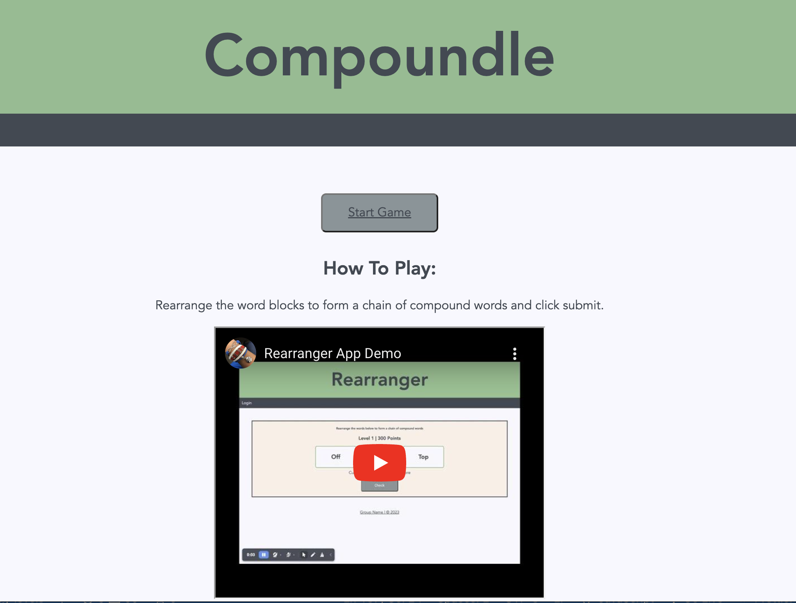
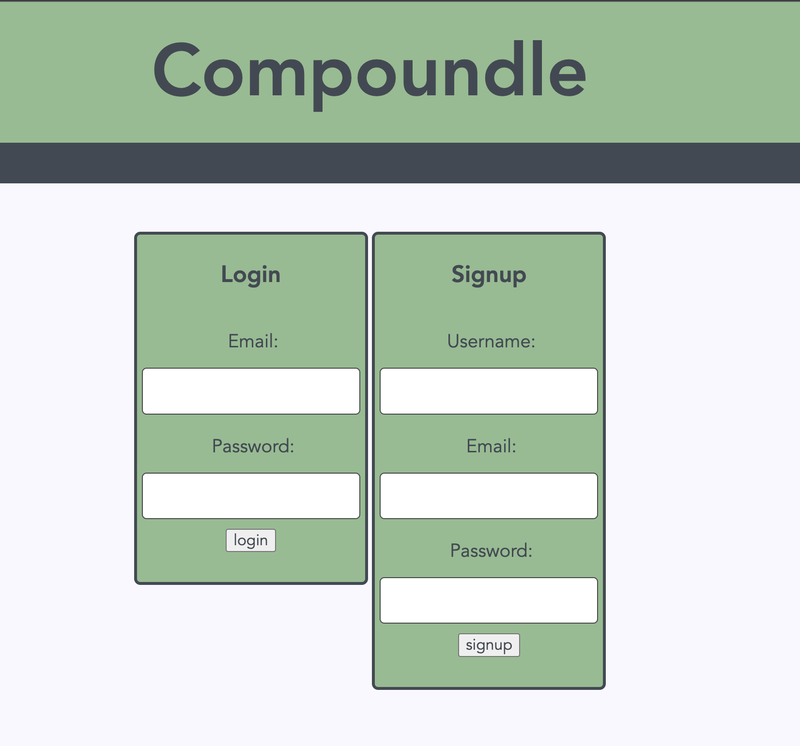
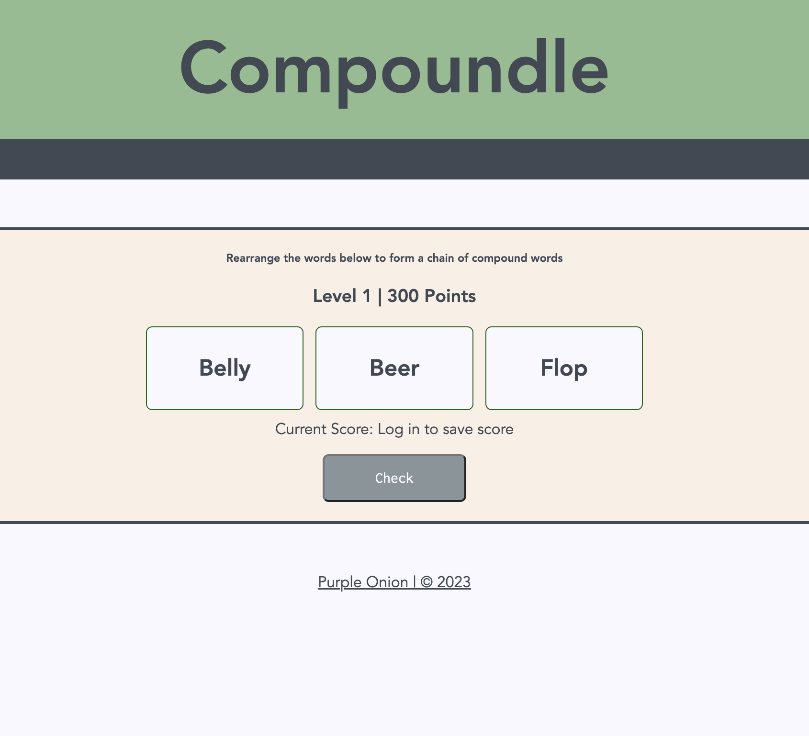

# Compoundle

Experience a fresh challenge every day with our original daily puzzle word game, where participants rearrange blocks to construct a interconnected chain of compound words and phrases. Log in to save your scores and view average attempts and completion times. Share your scores effortlessly with friends by utilizing our social media integration.

# Overview

This application offers an interactive experience where users can sign up to save their scores, or start playing immediately. Rearrange the words on the screen to form compound words or phrases with neighboring words (e.g., "Big Bird Seed" becomes Big Bird, Bird Seed). Verify your answers with the check button, and correct placements are highlighted in green, while incorrect ones are in red. Fill in blank spaces with the appropriate words for a seamless gaming experience. Click the hint button and reveal one letter of the hidden word per guess.

# Technologies

- JavaScript
- Node.js
- Express
- Handlebars.js
- MySQL
- HTML
- CSS
- Sequelize
- dotenv
- bcrypt

# Screenshots

 

# Application Links:

- [GITHUB Repo](https://github.com/fanny-travis-lenzlee-thomas/Compoundle)

- [Wireframes & Data Models](https://whimsical.com/wireframes-for-project-2-Wv3cRLETuxDvhTZVdxpumD)

- [Heroku URL](https://compoundle-0dc961311800.herokuapp.com/)

- [Presentation Slides](https://docs.google.com/presentation/d/1udoEdrk-y60uwwfj5SXelh5Vzoe-PKi9/edit?usp=sharing&ouid=112590629805992963889&rtpof=true&sd=true)

- [Demo Video](https://www.youtube.com/watch?v=zWC4_OTc_jg)

# Contributions

- The following files of code were modified or levereged from Northwestern Bootcamp Week 14 (MVC) Module 20.
  config/connections.js
  controllers/api/index.js
  controllers/index.js
  public/js/login.js
  public/js/logout.js
  utils/auth.js
  utils/helpers.js
  views/login.handlebars

- Sorting function (public/js/script.js lines 87-93), and getIdOfBlock functions (public/js/script.js lines 32-38) leveraged and modified from GeeksForGeeks.org user [geetanjali16](https://www.geeksforgeeks.org/how-to-create-a-drag-and-drop-feature-for-reordering-the-images-,using-html-css-and-jqueryui/)

- flip CSS Animation (public/js/styles.css 492-494, 509,521) leveraged and modified from user [Fralle](https://stackoverflow.com/questions/74192108/wordle-letter-flipping-animation) on StackOverFlow

- Confetti CSS Stylings and Animation (public/css/styles.css lines 367-509) leveraged and modified from [codepen.io user zer0kool](https://codepen.io/zer0kool/pen/KjZWRW)

- [MDN web docs](https://developer.mozilla.org/en-US/docs/Web/JavaScript) for reference when using JavaScript methods and functions

- [Sequelize Package](https://www.npmjs.com/package/sequelize)

- [dotenv package](https://www.npmjs.com/package/dotenv)

- [MySQL2 package](https://www.npmjs.com/package/mysql2)

- [Node.js](https://nodejs.org/en/docs)

# License

MIT License

Copyright (c) 2023 | fanny-travis-lenzlee-thomas | Purple Onions

Permission is hereby granted, free of charge, to any person obtaining a copy
of this software and associated documentation files (the "Software"), to deal
in the Software without restriction, including without limitation the rights
to use, copy, modify, merge, publish, distribute, sublicense, and/or sell
copies of the Software, and to permit persons to whom the Software is
furnished to do so, subject to the following conditions:

The above copyright notice and this permission notice shall be included in all
copies or substantial portions of the Software.

THE SOFTWARE IS PROVIDED "AS IS", WITHOUT WARRANTY OF ANY KIND, EXPRESS OR
IMPLIED, INCLUDING BUT NOT LIMITED TO THE WARRANTIES OF MERCHANTABILITY,
FITNESS FOR A PARTICULAR PURPOSE AND NONINFRINGEMENT. IN NO EVENT SHALL THE
AUTHORS OR COPYRIGHT HOLDERS BE LIABLE FOR ANY CLAIM, DAMAGES OR OTHER
LIABILITY, WHETHER IN AN ACTION OF CONTRACT, TORT OR OTHERWISE, ARISING FROM,
OUT OF OR IN CONNECTION WITH THE SOFTWARE OR THE USE OR OTHER DEALINGS IN THE
SOFTWARE.
